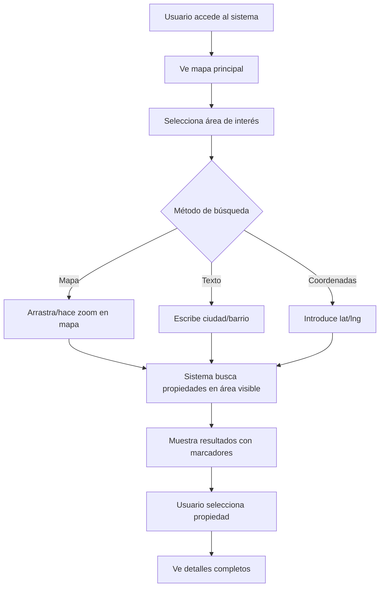
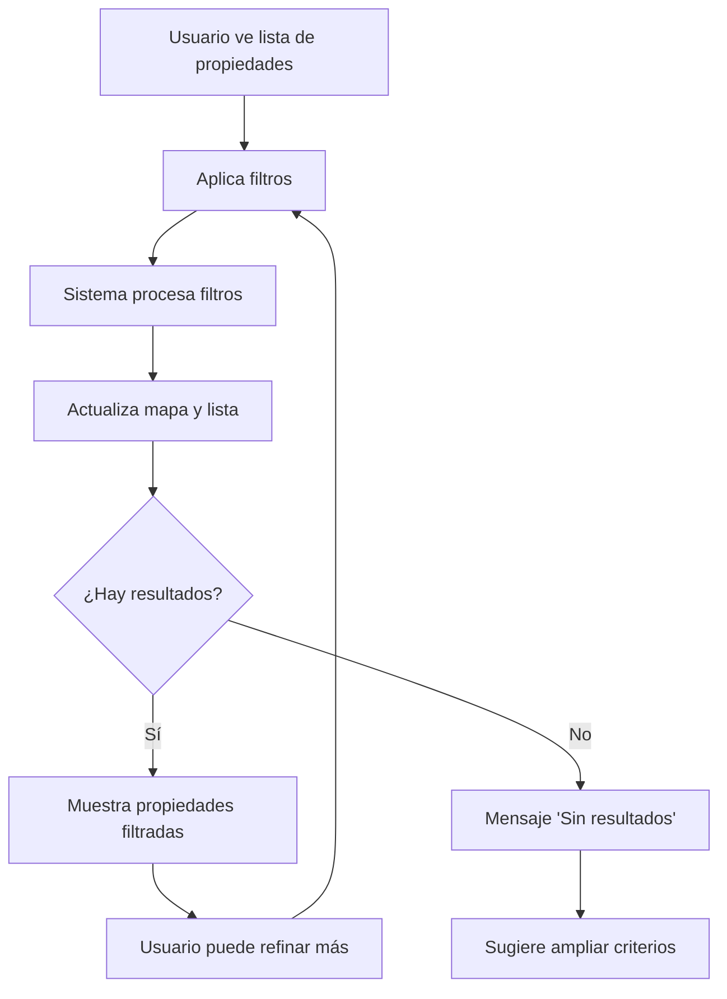
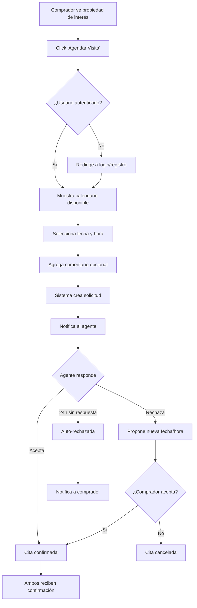
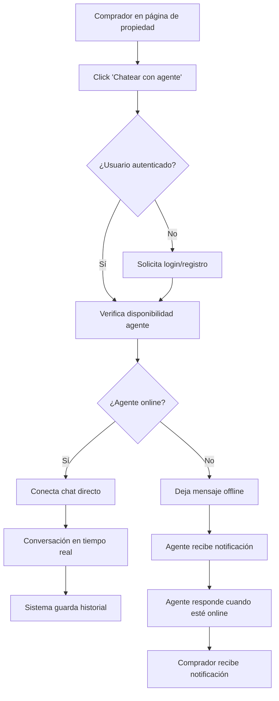
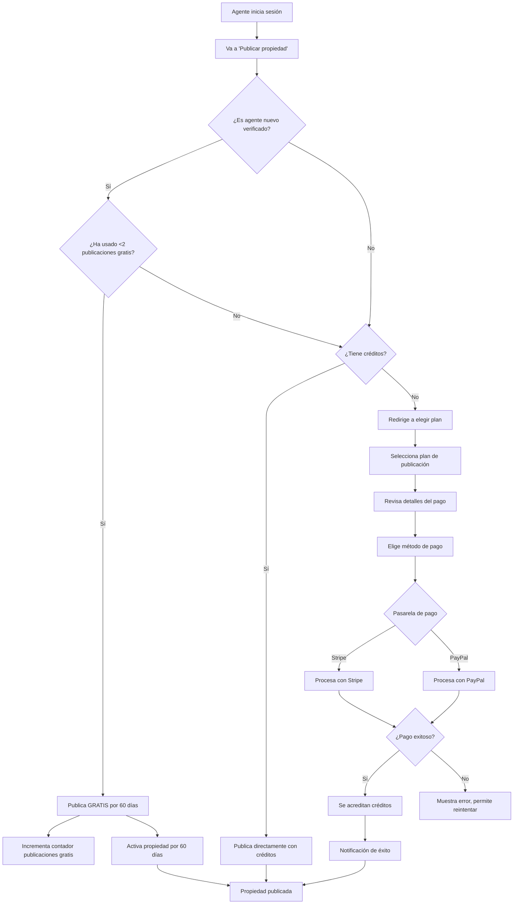

# 💼 PropFinder - Lógica de Negocio

## Portal Inmobiliario - Funcionalidades por Rol y Procesos de Negocio

---

## 🧩 FUNCIONALIDADES Y LÓGICA DE NEGOCIO POR ROL

### 🎯 **MODELO DE NEGOCIO SIMPLIFICADO**

- **Para Visitantes/Compradores:** Plataforma de búsqueda y contacto con agentes - **GRATIS**
- **Para Agentes:** Escaparate de propiedades con herramientas de gestión - **PAGO POR PUBLICACIÓN**
- **Para la Plataforma:** Ingresos por planes de publicación de agentes

### 🧠 **ROLES Y SUS ACCIONES**

| **Rol**              | **Puede hacer**                                                                    |
| -------------------- | ---------------------------------------------------------------------------------- |
| **👤 Visitante**     | Buscar propiedades, aplicar filtros, ver detalles, registrarse                     |
| **🏠 Comprador**     | Lo mismo + agendar visitas, chatear con agentes, guardar favoritos                 |
| **🏢 Agente**        | Publicar propiedades (tras pagar), responder chats, aceptar visitas, ver analytics |
| **⚙️ Administrador** | Ver estadísticas globales, moderar publicaciones, recibir pagos                    |

### 💰 **FUENTES DE INGRESOS**

#### **Ingresos ÚNICOS - Modelo Real:**

- **💳 Planes de Publicación (Pago Único):**
  - **Plan Starter:** $10 - 5 propiedades
  - **Plan Professional:** $18 - 10 propiedades
  - **Plan Premium:** $30 - 20 propiedades
  - **Plan Enterprise:** $50 - 50 propiedades

> **⚠️ IMPORTANTE:** Las propiedades NO se compran ni alquilan directamente desde el sistema. Solo es un escaparate/catálogo.

---

## 🔄 FUNCIONALIDADES ESPECÍFICAS DEL SISTEMA

### 1. 🏘️ **LISTADO DE PROPIEDADES CON BÚSQUEDA GEOESPACIAL**

#### **👤 Quién interactúa:**

- **Visitante** (sin registro)
- **Comprador registrado**

#### **🎯 Qué pueden hacer:**

- Buscar propiedades por ubicación (mapa interactivo, ciudad, barrio, coordenadas)
- Ver resultados ordenados por cercanía, precio, popularidad, fecha de publicación
- Navegar en mapa interactivo con marcadores de propiedades
- Zoom in/out para explorar áreas específicas

#### **Proceso de Búsqueda Geoespacial:**



#### **Reglas de Negocio - Búsqueda Geoespacial:**

- **RN-GEO001:** Búsqueda sin autenticación muestra máximo 20 resultados
- **RN-GEO002:** Usuarios registrados ven todos los resultados disponibles
- **RN-GEO003:** Radio de búsqueda máximo: 50km desde punto central
- **RN-GEO004:** Propiedades se muestran con precisión de calle (no dirección exacta)
- **RN-GEO005:** Ordenamiento por defecto: distancia al centro de búsqueda

### 2. 🔍 **SISTEMA DE FILTROS AVANZADOS**

#### **👤 Quién interactúa:**

- **Visitante** (sin registro) - filtros básicos
- **Comprador registrado** - todos los filtros

#### **🎯 Qué pueden hacer:**

- Filtrar por tipo de propiedad (casa, apartamento, local comercial, terreno)
- Filtrar por número de habitaciones, baños
- Rango de precios (mín-máx)
- Estado (venta/alquiler)
- Características especiales (piscina, garaje, amoblado, etc.)
- Año de construcción, área construida

#### **Proceso de Filtrado:**



#### **Reglas de Negocio - Filtros:**

- **RN-FIL001:** Filtros se mantienen activos durante la sesión
- **RN-FIL002:** Usuarios registrados pueden guardar combinaciones de filtros
- **RN-FIL003:** Precio mínimo no puede ser mayor que precio máximo
- **RN-FIL004:** Máximo 10 filtros simultáneos para mantener performance

### 3. 📅 **AGENDAMIENTO DE VISITAS**

#### **👤 Quién interactúa:**

- **Comprador registrado** (solicita)
- **Agente** (acepta/rechaza)

#### **🎯 Proceso completo:**



#### **Reglas de Negocio - Agendamiento:**

- **RN-AG001:** Solo usuarios registrados pueden agendar visitas
- **RN-AG002:** Citas mínimo con 24h de anticipación
- **RN-AG003:** Máximo 3 citas pendientes por comprador
- **RN-AG004:** Agente debe responder en máximo 24 horas
- **RN-AG005:** Recordatorios automáticos 2h antes de la cita
- **RN-AG006:** Sistema permite cancelar hasta 2h antes

### 4. 💬 **CHAT EN TIEMPO REAL CON AGENTES**

#### **👤 Quién interactúa:**

- **Comprador registrado** (inicia chat)
- **Agente** (responde)

#### **🎯 Proceso de Chat:**



#### **Características del Chat:**

- **Supabase Realtime** (opción recomendada) o **WebSocket/Firebase** para tiempo real
- **Historial** guardado por 30 días en PostgreSQL
- **Notificaciones push** para mensajes nuevos
- **Archivos/imágenes** permitidos (max 5MB)

#### **Reglas de Negocio - Chat:**

- **RN-CH001:** Solo usuarios registrados pueden chatear
- **RN-CH002:** Historial accesible por 30 días
- **RN-CH003:** Chat inactivo por 30 min se cierra automáticamente
- **RN-CH004:** Máximo 5 chats simultáneos por agente
- **RN-CH005:** Filtro automático de contenido inapropiado

### 5. 💳 **PLANES DE PUBLICACIÓN PARA AGENTES (PAGO ÚNICO)**

#### **👤 Quién interactúa:**

- **Agente** (compra créditos)
- **Sistema de pagos** (procesa transacción)
- **Administrador** (recibe ingresos)

#### **🎯 Flujo de Pago Paso a Paso ACTUALIZADO:**



#### **📊 Planes de Publicación:**

| **Plan**         | **Precio** | **Publicaciones** | **Duración** |
| ---------------- | ---------- | ----------------- | ------------ |
| **Starter**      | $10        | 5 propiedades     | 90 días c/u  |
| **Professional** | $18        | 10 propiedades    | 90 días c/u  |
| **Premium**      | $30        | 20 propiedades    | 120 días c/u |
| **Enterprise**   | $50        | 50 propiedades    | 120 días c/u |

#### **Reglas de Negocio - Pagos:**

- **RN-PA001:** Pagos procesados solo por Stripe y PayPal
- **RN-PA002:** Créditos no expiran (las publicaciones sí)
- **RN-PA003:** Sin reembolsos una vez usado el crédito
- **RN-PA004:** Factura automática por cada compra
- **RN-PA005:** Máximo 3 intentos de pago por transacción

### 6. 📊 **PANEL DE ANALYTICS PARA AGENTES**

#### **👤 Quién interactúa:**

- **Agente** (ve sus métricas)

#### **🎯 Qué pueden ver:**

#### **📈 Métricas por Propiedad:**

- **Total de vistas** por propiedad
- **Vistas únicas** vs **vistas totales**
- **Cuántos agendaron visitas**
- **Cuántas personas contactaron al agente** (chat iniciado)
- **Tasa de conversión** (vista → contacto)
- **Tasa de interés** (vista → cita agendada)
- **Mensajes/chats recibidos**
- **Veces agregada a favoritos**
- **Tiempo promedio en la página** de la propiedad
- **Origen del tráfico** (búsqueda, mapa, enlace directo)

#### **📊 Métricas Generales:**

- **Top 5 propiedades** más visitadas
- **Propiedades con mayor engagement** (contactos/vista)
- **Rendimiento semanal/mensual**
- **Gráficos de tendencias** de vistas y contactos
- **Comparativo con período anterior**
- **Análisis de conversión** por tipo de propiedad

#### **Dashboard de Analytics:**

```javascript
// Ejemplo de métricas que ve el agente
const agentAnalytics = {
  properties: [
    {
      id: "prop001",
      title: "Casa en Zona Norte",
      views: 145,
      uniqueViews: 98,
      scheduledVisits: 12,
      contactsInitiated: 18, // Personas que iniciaron chat
      chats: 8, // Conversaciones completadas
      favorites: 23,
      avgTimeOnPage: "3m 45s",
      trafficSources: {
        search: 60,
        map: 45,
        direct: 40,
      },
      conversionRates: {
        viewToContact: "12.4%", // 18 contactos / 145 vistas
        viewToVisit: "8.3%", // 12 visitas / 145 vistas
        contactToVisit: "66.7%", // 12 visitas / 18 contactos
      },
    },
  ],
  summary: {
    totalViews: 1250,
    totalUniqueViews: 892,
    totalContacts: 89, // Personas únicas que contactaron
    totalChats: 45, // Conversaciones iniciadas
    totalVisits: 67,
    avgConversionRate: "7.1%",
    bestPerformingProperty: {
      title: "Apartamento Centro",
      conversionRate: "15.2%",
    },
  },
};
```

#### **Reglas de Negocio - Analytics:**

- **RN-AN001:** Métricas se actualizan cada hora
- **RN-AN002:** Datos disponibles de últimos 6 meses
- **RN-AN003:** Reportes exportables en PDF/Excel
- **RN-AN004:** Solo el agente propietario ve sus métricas
- **RN-AN005:** Se registra cada vista única por usuario/IP
- **RN-AN006:** Contacto se cuenta cuando se inicia primer chat
- **RN-AN007:** Tiempo en página se mide desde entrada hasta salida
- **RN-AN008:** Métricas anónimas para reportes generales del sistema

---

## � DETALLES DEL FLUJO DE PAGOS

### 🎯 **OBJETIVO DEL PAGO:**

**Publicar propiedades** (NO comprar propiedades directamente desde la plataforma)

### 💰 **QUIÉN PAGA Y QUIÉN RECIBE:**

- **✅ Quién paga:** El agente inmobiliario
- **✅ Quién recibe:** La plataforma PropFinder (administrador del sistema)
- **✅ Cómo:** Integración con pasarelas de pago (Stripe, PayPal)

### 🔄 **FLUJO TÉCNICO DETALLADO:**

```javascript
// Flujo de pago paso a paso
const paymentFlow = {
  step1: "Agente inicia sesión",
  step2: 'Va a sección "Publicar propiedad"',
  step3: "Sistema verifica créditos disponibles",
  step4: 'Si no tiene créditos → redirige a "Elegir plan"',
  step5: "Agente selecciona plan (Ej: 10 publicaciones por $18)",
  step6: "Sistema muestra checkout de pasarela",
  step7: "Agente completa información de pago",
  step8: "Pasarela procesa el pago",
  step9: "Si exitoso → webhook confirma a nuestro sistema",
  step10: "Sistema activa créditos en cuenta del agente",
  step11: "Agente puede publicar propiedades",
};
```

### 🔐 **INTEGRACIÓN CON PASARELAS:**

#### **Stripe Integration:**

```javascript
// Ejemplo de integración con Stripe
const stripe = require("stripe")(process.env.STRIPE_SECRET_KEY);

const createPaymentIntent = async (planPrice, agentId) => {
  const paymentIntent = await stripe.paymentIntents.create({
    amount: planPrice * 100, // Stripe usa centavos
    currency: "usd",
    metadata: {
      agentId: agentId,
      plan: "professional_10_credits",
    },
  });

  return paymentIntent;
};

// Webhook para confirmar pago
app.post("/webhook/stripe", (req, res) => {
  const event = req.body;

  if (event.type === "payment_intent.succeeded") {
    const { agentId } = event.data.object.metadata;
    // Activar créditos para el agente
    activateCredits(agentId, 10);
  }
});
```

#### **PayPal Integration:**

```javascript
// Ejemplo de integración con PayPal
const paypal = require("@paypal/checkout-server-sdk");

const createOrder = async (planPrice) => {
  const request = new paypal.orders.OrdersCreateRequest();
  request.requestBody({
    intent: "CAPTURE",
    purchase_units: [
      {
        amount: {
          currency_code: "USD",
          value: planPrice.toString(),
        },
      },
    ],
  });

  const order = await client.execute(request);
  return order;
};
```

### ⚠️ **NOTAS TÉCNICAS IMPORTANTES:**

#### **🏠 Sobre las Propiedades:**

- **NO hay transacciones** de compra/venta de inmuebles en el sistema
- **NO hay contratos** digitales de propiedades
- **NO se manejan pagos** entre compradores y vendedores
- **Solo es un escaparate/catálogo** para mostrar propiedades

#### **💳 Sobre los Pagos:**

- **Único tipo de pago:** Agentes comprando créditos para publicar
- **No hay suscripciones:** Son pagos únicos por paquetes
- **No hay reembolsos** automáticos una vez usados los créditos
- **Facturación simple:** Una factura por cada compra de créditos

### 📊 **MODELO DE CRÉDITOS:**

```javascript
// Sistema de créditos para agentes
const creditSystem = {
  plans: {
    starter: { price: 10, credits: 5, duration: 90 },
    professional: { price: 18, credits: 10, duration: 90 },
    premium: { price: 30, credits: 20, duration: 120 },
    enterprise: { price: 50, credits: 50, duration: 120 },
  },

  usage: {
    publishProperty: -1, // Cuesta 1 crédito publicar
    renewProperty: -1, // Cuesta 1 crédito renovar por otros 90 días
    // Los créditos no expiran, pero las publicaciones sí
  },

  // NUEVA REGLA: Primeras 2 publicaciones gratis
  newAgentBonus: {
    freePublications: 2,
    duration: 60, // días de duración para cada publicación gratuita
    conditions: "Solo para agentes recién registrados y verificados",
  },
};
```

### 🔄 **ESTADOS DE PROPIEDADES:**

| **Estado**   | **Descripción**          | **Acción del Agente**                      | **Costo**                       |
| ------------ | ------------------------ | ------------------------------------------ | ------------------------------- |
| **Borrador** | Creada pero no publicada | Puede editar libremente                    | Gratis                          |
| **Activa**   | Visible en búsquedas     | Consume 1 crédito, dura según plan         | 1 crédito o gratis (primeras 2) |
| **Expirada** | Ya no visible            | Puede renovar por 1 crédito                | 1 crédito                       |
| **Pausada**  | Temporalmente oculta     | Puede reactivar sin costo                  | Gratis                          |
| **Gratis**   | Publicación promocional  | Primeras 2 publicaciones de nuevos agentes | Gratis (60 días)                |

---

## 🧠 REGLAS DE NEGOCIO ESPECÍFICAS POR FUNCIONALIDAD

### 🏘️ **REGLAS - BÚSQUEDA GEOESPACIAL:**

- **RN-GEO001:** Búsqueda sin registro: máximo 20 resultados
- **RN-GEO002:** Registrados ven todos los resultados disponibles
- **RN-GEO003:** Radio máximo de búsqueda: 50km
- **RN-GEO004:** Coordenadas almacenadas con precisión de 100m (privacidad)
- **RN-GEO005:** Mapa carga propiedades en viewport actual

### 🔍 **REGLAS - FILTROS AVANZADOS:**

- **RN-FIL001:** Visitantes: filtros básicos (tipo, precio, habitaciones)
- **RN-FIL002:** Registrados: todos los filtros disponibles
- **RN-FIL003:** Filtros se mantienen en sesión
- **RN-FIL004:** Usuarios pueden guardar combinaciones de filtros
- **RN-FIL005:** Máximo 10 filtros simultáneos por performance

### � **REGLAS - AGENDAMIENTO:**

- **RN-AG001:** Solo compradores registrados pueden agendar
- **RN-AG002:** Anticipación mínima: 24 horas
- **RN-AG003:** Máximo 3 citas pendientes por comprador
- **RN-AG004:** Agentes deben responder en 24h máximo
- **RN-AG005:** Auto-rechazo si no hay respuesta en 24h
- **RN-AG006:** Recordatorios 2h antes de la cita

### 💬 **REGLAS - CHAT:**

- **RN-CH001:** Solo usuarios registrados pueden chatear
- **RN-CH002:** Historial guardado 30 días
- **RN-CH003:** Auto-cierre después de 30min inactividad
- **RN-CH004:** Máximo 5 chats simultáneos por agente
- **RN-CH005:** Filtro automático de contenido inapropiado
- **RN-CH006:** Notificaciones push para mensajes nuevos

### 💳 **REGLAS - PAGOS Y CRÉDITOS:**

- **RN-CR001:** 1 crédito = 1 publicación por 90/120 días
- **RN-CR002:** Créditos no expiran, publicaciones sí
- **RN-CR003:** Sin reembolso de créditos usados
- **RN-CR004:** Renovar publicación cuesta 1 crédito
- **RN-CR005:** Pausar/reactivar no consume créditos
- **RN-CR006:** Máximo 3 intentos de pago fallido
- **RN-CR007:** **NUEVO:** Agentes nuevos reciben 2 publicaciones gratis
- **RN-CR008:** **NUEVO:** Publicaciones gratis duran 60 días cada una
- **RN-CR009:** **NUEVO:** Bonus gratis solo para cuentas verificadas
- **RN-CR010:** **NUEVO:** Después de usar publicaciones gratis, debe comprar créditos

### 📊 **REGLAS - ANALYTICS:**

- **RN-AN001:** Solo agente propietario ve métricas de sus propiedades
- **RN-AN002:** Datos actualizados cada hora
- **RN-AN003:** Histórico de 6 meses disponible
- **RN-AN004:** Exportación en PDF/Excel para planes Premium+
- **RN-AN005:** **NUEVO:** Vista única = 1 persona viendo 1 propiedad (por IP/usuario)
- **RN-AN006:** **NUEVO:** Contacto = cuando usuario inicia primer chat con agente
- **RN-AN007:** **NUEVO:** Se registra tiempo exacto en página de propiedad
- **RN-AN008:** **NUEVO:** Fuente de tráfico se identifica automáticamente
- **RN-AN009:** **NUEVO:** Métricas de conversión calculadas automáticamente
- **RN-AN010:** Métricas anónimas para reportes generales

---

## 🎯 CASOS DE USO POR ROL

### � **VISITANTE (Sin registro)**

#### **Casos de Uso:**

1. **CU-V001:** Ver propiedades en mapa interactivo
2. **CU-V002:** Buscar por ciudad/barrio
3. **CU-V003:** Aplicar filtros básicos (precio, tipo, habitaciones)
4. **CU-V004:** Ver detalles de máximo 20 propiedades
5. **CU-V005:** Registrarse para acceso completo

#### **Limitaciones:**

- ❌ No puede agendar visitas
- ❌ No puede chatear con agentes
- ❌ Máximo 20 resultados de búsqueda
- ❌ No puede guardar favoritos
- ❌ No puede guardar búsquedas

### 🏠 **COMPRADOR REGISTRADO**

#### **Casos de Uso:**

1. **CU-C001:** Todos los casos de uso de Visitante sin limitaciones
2. **CU-C002:** Agendar visitas a propiedades
3. **CU-C003:** Chatear en tiempo real con agentes
4. **CU-C004:** Guardar propiedades favoritas
5. **CU-C005:** Guardar combinaciones de filtros personalizadas
6. **CU-C006:** Recibir notificaciones de nuevas propiedades
7. **CU-C007:** Ver historial de chats por 30 días
8. **CU-C008:** Gestionar sus citas agendadas

#### **Flujo típico:**

```
Registro → Búsqueda → Filtros → Ve propiedad →
Chat con agente → Agenda visita → Recibe confirmación
```

### 🏢 **AGENTE INMOBILIARIO**

#### **Casos de Uso:**

1. **CU-A001:** Comprar créditos para publicaciones
2. **CU-A002:** Publicar propiedades (con créditos)
3. **CU-A003:** Gestionar sus propiedades (editar, pausar, renovar)
4. **CU-A004:** Responder chats de compradores interesados
5. **CU-A005:** Gestionar solicitudes de visitas (aceptar/rechazar)
6. **CU-A006:** Ver analytics de rendimiento de propiedades
7. **CU-A007:** Recibir notificaciones de nuevos leads
8. **CU-A008:** Exportar reportes de analytics

#### **Flujo típico:**

```
Compra créditos → Publica propiedad → Recibe leads →
Responde chats → Agenda visitas → Ve analytics
```

### ⚙️ **ADMINISTRADOR**

#### **Casos de Uso:**

1. **CU-AD001:** Ver dashboard general del sistema
2. **CU-AD002:** Moderar propiedades reportadas
3. **CU-AD003:** Gestionar usuarios (suspender/activar)
4. **CU-AD004:** Ver reportes financieros de ingresos
5. **CU-AD005:** Configurar precios de planes
6. **CU-AD006:** Monitorear performance del sistema

---

## 🚀 ESPECIFICACIONES TÉCNICAS

### �️ **MODELO DE DATOS SIMPLIFICADO**

#### **Entidades Principales:**

```javascript
// Usuario
const User = {
  id: "uuid",
  email: "string",
  password: "hashed_string",
  role: "visitor|buyer|agent|admin",
  profile: {
    name: "string",
    phone: "string",
    avatar: "url",
  },
  preferences: {
    notifications: "boolean",
    savedSearches: "array",
  },
};

// Agente (extiende User)
const Agent = {
  ...User,
  credits: "number", // Créditos disponibles
  totalCreditsUsed: "number",
  freePublicationsUsed: "number", // NUEVO: Publicaciones gratis usadas
  isNewAgent: "boolean", // NUEVO: Si puede usar publicaciones gratis
  licenseNumber: "string",
  verified: "boolean",
  rating: "number", // 1-5 estrellas
  joinedAt: "datetime", // NUEVO: Para determinar elegibilidad bonus
};

// Propiedad
const Property = {
  id: "uuid",
  agentId: "uuid",
  title: "string",
  description: "text",
  price: "number",
  type: "house|apartment|commercial|land",
  status: "sale|rent",
  state: "draft|active|expired|paused|free", // NUEVO: estado 'free'
  isFreePublication: "boolean", // NUEVO: Si usa publicación gratis
  location: {
    address: "string",
    city: "string",
    coordinates: { lat: "number", lng: "number" },
  },
  features: {
    bedrooms: "number",
    bathrooms: "number",
    area: "number",
    parking: "boolean",
    pool: "boolean",
  },
  images: ["url"],
  publishedAt: "datetime",
  expiresAt: "datetime",
};

// NUEVA ENTIDAD: Analytics de Propiedades
const PropertyAnalytics = {
  id: "uuid",
  propertyId: "uuid",
  totalViews: "number",
  uniqueViews: "number",
  contactsInitiated: "number", // NUEVO: Cuántas personas contactaron
  chatsStarted: "number",
  visitsScheduled: "number",
  timesFavorited: "number",
  avgTimeOnPage: "number", // En segundos
  trafficSources: {
    search: "number",
    map: "number",
    direct: "number",
    social: "number",
  },
  lastUpdated: "datetime",
};

// NUEVA ENTIDAD: Eventos de Tracking
const TrackingEvent = {
  id: "uuid",
  propertyId: "uuid",
  userId: "uuid", // null si es visitante anónimo
  sessionId: "uuid", // Para agrupar eventos de una sesión
  eventType: "view|contact|chat|visit_request|favorite|exit", // NUEVO
  source: "search|map|direct|social", // NUEVO
  userAgent: "string",
  ipAddress: "string", // Para vistas únicas
  duration: "number", // Tiempo en página (para exits)
  createdAt: "datetime",
};

// Cita
const Appointment = {
  id: "uuid",
  propertyId: "uuid",
  buyerId: "uuid",
  agentId: "uuid",
  requestedDate: "datetime",
  status: "pending|confirmed|rejected|completed",
  notes: "string",
};

// Chat
const ChatSession = {
  id: "uuid",
  propertyId: "uuid",
  buyerId: "uuid",
  agentId: "uuid",
  messages: [
    {
      senderId: "uuid",
      message: "string",
      timestamp: "datetime",
    },
  ],
  status: "active|closed",
  createdAt: "datetime",
};

// Transacción de Pago
const Payment = {
  id: "uuid",
  agentId: "uuid",
  plan: "starter|professional|premium|enterprise",
  amount: "number",
  creditsAwarded: "number",
  paymentMethod: "stripe|paypal",
  transactionId: "string", // ID de la pasarela
  status: "pending|completed|failed",
  createdAt: "datetime",
};
```

### � **STACK TECNOLÓGICO RECOMENDADO**

#### **Frontend:**

- **React.js** con TypeScript
- **Leaflet/Mapbox** para mapas interactivos
- **Supabase-js** para chat en tiempo real y base de datos
- **Stripe.js** para procesamiento de pagos
- **Tailwind CSS** para estilos

#### **Backend:**

- **Supabase** (Backend-as-a-Service completo)
  - **PostgreSQL** integrado
  - **Realtime subscriptions** para chat
  - **Auth** incorporado
  - **Storage** para imágenes
  - **Edge Functions** para lógica custom
- **Node.js/Express** (opcional, solo para lógica específica)
- **TypeScript** para type safety

#### **Base de Datos:**

- **Supabase PostgreSQL** (principal con Realtime)
- **Supabase Storage** (imágenes y archivos)

#### **Servicios Externos:**

- **Stripe** + **PayPal** (pagos)
- **Supabase Storage** (imágenes y archivos de chat)
- **SendGrid/Supabase Email** (emails)
- **Supabase Push Notifications** (notificaciones)

### 🏗️ **ARQUITECTURA SUGERIDA CON SUPABASE**

```
Frontend (React + Supabase-js)
    ↓
┌─────────────────────────────────────┐
│           SUPABASE                  │
│  ┌─────────────┬─────────────────┐  │
│  │ PostgreSQL  │  Realtime API   │  │
│  │             │  (Chat/Updates) │  │
│  ├─────────────┼─────────────────┤  │
│  │    Auth     │    Storage      │  │
│  │             │   (Images)      │  │
│  ├─────────────┼─────────────────┤  │
│  │Edge Functions│  Push Notifs   │  │
│  │ (Webhooks)  │                 │  │
│  └─────────────┴─────────────────┘  │
└─────────────────────────────────────┘
    ↓
External Payment APIs (Stripe/PayPal)
```

### 💡 **VENTAJAS DE USAR SUPABASE PARA CHAT:**

#### **✅ Beneficios Técnicos:**

- **Tiempo real nativo:** PostgreSQL + Realtime subscriptions
- **Sin servidor adicional:** No necesitas Socket.io o WebSocket server
- **Escalabilidad automática:** Supabase maneja la infraestructura
- **Persistencia integrada:** Mensajes guardados en PostgreSQL automáticamente
- **Auth integrado:** Autenticación ya incluida

#### **✅ Beneficios de Desarrollo:**

- **Menos código:** No necesitas manejar conexiones WebSocket manualmente
- **TypeScript nativo:** Supabase genera tipos automáticamente
- **Desarrollo más rápido:** Backend completo sin configuración
- **Costo-efectivo:** Plan gratuito generoso para empezar

### 🔧 **IMPLEMENTACIÓN DE CHAT CON SUPABASE:**

#### **Estructura de la tabla `chat_messages`:**

```sql
CREATE TABLE chat_messages (
  id UUID DEFAULT gen_random_uuid() PRIMARY KEY,
  session_id UUID REFERENCES chat_sessions(id),
  sender_id UUID REFERENCES users(id),
  message TEXT NOT NULL,
  message_type VARCHAR(20) DEFAULT 'text', -- 'text', 'image', 'file'
  file_url TEXT,
  created_at TIMESTAMP WITH TIME ZONE DEFAULT NOW()
);

-- Habilitar Realtime
ALTER PUBLICATION supabase_realtime ADD TABLE chat_messages;
```

### 📊 **IMPLEMENTACIÓN DEL SISTEMA DE MÉTRICAS:**

#### **Tablas SQL para Analytics:**

```sql
-- Tabla principal de analytics por propiedad
CREATE TABLE property_analytics (
  id UUID DEFAULT gen_random_uuid() PRIMARY KEY,
  property_id UUID REFERENCES properties(id) ON DELETE CASCADE,
  total_views INTEGER DEFAULT 0,
  unique_views INTEGER DEFAULT 0,
  contacts_initiated INTEGER DEFAULT 0,
  chats_started INTEGER DEFAULT 0,
  visits_scheduled INTEGER DEFAULT 0,
  times_favorited INTEGER DEFAULT 0,
  avg_time_on_page INTEGER DEFAULT 0, -- en segundos
  traffic_search INTEGER DEFAULT 0,
  traffic_map INTEGER DEFAULT 0,
  traffic_direct INTEGER DEFAULT 0,
  traffic_social INTEGER DEFAULT 0,
  last_updated TIMESTAMP WITH TIME ZONE DEFAULT NOW(),
  UNIQUE(property_id)
);

-- Tabla de eventos de tracking
CREATE TABLE tracking_events (
  id UUID DEFAULT gen_random_uuid() PRIMARY KEY,
  property_id UUID REFERENCES properties(id) ON DELETE CASCADE,
  user_id UUID REFERENCES users(id) ON DELETE SET NULL,
  session_id UUID NOT NULL,
  event_type VARCHAR(20) NOT NULL, -- 'view', 'contact', 'chat', 'visit_request', 'favorite', 'exit'
  source VARCHAR(20) DEFAULT 'direct', -- 'search', 'map', 'direct', 'social'
  user_agent TEXT,
  ip_address INET,
  duration INTEGER, -- Para eventos 'exit', tiempo en segundos
  created_at TIMESTAMP WITH TIME ZONE DEFAULT NOW()
);

-- Índices para performance
CREATE INDEX idx_tracking_events_property_id ON tracking_events(property_id);
CREATE INDEX idx_tracking_events_created_at ON tracking_events(created_at);
CREATE INDEX idx_tracking_events_session_id ON tracking_events(session_id);

-- Función para actualizar analytics automáticamente
CREATE OR REPLACE FUNCTION update_property_analytics()
RETURNS TRIGGER AS $$
BEGIN
  -- Actualizar analytics basado en el nuevo evento
  INSERT INTO property_analytics (property_id)
  VALUES (NEW.property_id)
  ON CONFLICT (property_id) DO NOTHING;

  -- Actualizar contadores según el tipo de evento
  UPDATE property_analytics SET
    total_views = total_views + CASE WHEN NEW.event_type = 'view' THEN 1 ELSE 0 END,
    contacts_initiated = contacts_initiated + CASE WHEN NEW.event_type = 'contact' THEN 1 ELSE 0 END,
    chats_started = chats_started + CASE WHEN NEW.event_type = 'chat' THEN 1 ELSE 0 END,
    visits_scheduled = visits_scheduled + CASE WHEN NEW.event_type = 'visit_request' THEN 1 ELSE 0 END,
    times_favorited = times_favorited + CASE WHEN NEW.event_type = 'favorite' THEN 1 ELSE 0 END,
    traffic_search = traffic_search + CASE WHEN NEW.source = 'search' AND NEW.event_type = 'view' THEN 1 ELSE 0 END,
    traffic_map = traffic_map + CASE WHEN NEW.source = 'map' AND NEW.event_type = 'view' THEN 1 ELSE 0 END,
    traffic_direct = traffic_direct + CASE WHEN NEW.source = 'direct' AND NEW.event_type = 'view' THEN 1 ELSE 0 END,
    traffic_social = traffic_social + CASE WHEN NEW.source = 'social' AND NEW.event_type = 'view' THEN 1 ELSE 0 END,
    last_updated = NOW()
  WHERE property_id = NEW.property_id;

  RETURN NEW;
END;
$$ LANGUAGE plpgsql;

-- Trigger para actualizar analytics automáticamente
CREATE TRIGGER trigger_update_property_analytics
  AFTER INSERT ON tracking_events
  FOR EACH ROW EXECUTE FUNCTION update_property_analytics();
```

#### **Sistema de Publicaciones Gratis:**

```sql
-- Añadir campos a la tabla de agentes
ALTER TABLE agents ADD COLUMN free_publications_used INTEGER DEFAULT 0;
ALTER TABLE agents ADD COLUMN is_new_agent BOOLEAN DEFAULT TRUE;
ALTER TABLE agents ADD COLUMN joined_at TIMESTAMP WITH TIME ZONE DEFAULT NOW();

-- Añadir campos a la tabla de propiedades
ALTER TABLE properties ADD COLUMN is_free_publication BOOLEAN DEFAULT FALSE;

-- Función para verificar si puede usar publicación gratis
CREATE OR REPLACE FUNCTION can_use_free_publication(agent_uuid UUID)
RETURNS BOOLEAN AS $$
DECLARE
  agent_record RECORD;
BEGIN
  SELECT free_publications_used, is_new_agent, verified
  INTO agent_record
  FROM agents
  WHERE id = agent_uuid;

  -- Puede usar gratis si: es nuevo, está verificado y no ha usado las 2 gratis
  RETURN agent_record.is_new_agent
         AND agent_record.verified
         AND agent_record.free_publications_used < 2;
END;
$$ LANGUAGE plpgsql;

-- Función para consumir publicación gratis
CREATE OR REPLACE FUNCTION use_free_publication(agent_uuid UUID, property_uuid UUID)
RETURNS BOOLEAN AS $$
BEGIN
  -- Verificar si puede usar gratis
  IF NOT can_use_free_publication(agent_uuid) THEN
    RETURN FALSE;
  END IF;

  -- Marcar propiedad como publicación gratis
  UPDATE properties
  SET is_free_publication = TRUE,
      state = 'active',
      published_at = NOW(),
      expires_at = NOW() + INTERVAL '60 days'
  WHERE id = property_uuid;

  -- Incrementar contador de publicaciones gratis usadas
  UPDATE agents
  SET free_publications_used = free_publications_used + 1
  WHERE id = agent_uuid;

  -- Si ya usó las 2, ya no es agente nuevo
  UPDATE agents
  SET is_new_agent = FALSE
  WHERE id = agent_uuid AND free_publications_used >= 2;

  RETURN TRUE;
END;
$$ LANGUAGE plpgsql;
```

#### **Código JavaScript para Tracking de Métricas:**

```javascript
// Hook personalizado para tracking de propiedades
import { useEffect, useRef } from "react";
import { supabase } from "./supabaseClient";

const usePropertyTracking = (propertyId, source = "direct") => {
  const sessionId = useRef(crypto.randomUUID());
  const startTime = useRef(Date.now());
  const hasTrackedView = useRef(false);
  const hasTrackedContact = useRef(false);

  // Tracking de vista de propiedad
  useEffect(() => {
    if (!hasTrackedView.current) {
      trackEvent("view", propertyId, source);
      hasTrackedView.current = true;
    }

    // Cleanup: tracking cuando sale de la página
    return () => {
      const timeSpent = Math.floor((Date.now() - startTime.current) / 1000);
      trackEvent("exit", propertyId, source, timeSpent);
    };
  }, [propertyId, source]);

  // Función para trackear eventos específicos
  const trackEvent = async (
    eventType,
    propId,
    eventSource,
    duration = null
  ) => {
    try {
      const {
        data: { user },
      } = await supabase.auth.getUser();

      await supabase.from("tracking_events").insert({
        property_id: propId,
        user_id: user?.id || null,
        session_id: sessionId.current,
        event_type: eventType,
        source: eventSource,
        user_agent: navigator.userAgent,
        duration: duration,
        ip_address: null, // Se obtiene del servidor
      });
    } catch (error) {
      console.error("Error tracking event:", error);
    }
  };

  // Función para trackear contacto con agente
  const trackContact = () => {
    if (!hasTrackedContact.current) {
      trackEvent("contact", propertyId, source);
      hasTrackedContact.current = true;
    }
  };

  // Función para trackear otras acciones
  const trackAction = (action) => {
    trackEvent(action, propertyId, source);
  };

  return { trackContact, trackAction };
};

// Componente de página de propiedad con tracking
const PropertyDetailPage = ({ propertyId, source }) => {
  const { trackContact, trackAction } = usePropertyTracking(propertyId, source);

  const handleChatStart = () => {
    trackContact(); // Trackea que el usuario contactó al agente
    // Lógica para iniciar chat...
  };

  const handleScheduleVisit = () => {
    trackAction("visit_request");
    // Lógica para agendar visita...
  };

  const handleAddToFavorites = () => {
    trackAction("favorite");
    // Lógica para agregar a favoritos...
  };

  return (
    <div className="property-detail">
      {/* Contenido de la propiedad */}
      <button onClick={handleChatStart}>Chatear con Agente</button>
      <button onClick={handleScheduleVisit}>Agendar Visita</button>
      <button onClick={handleAddToFavorites}>❤️ Favorito</button>
    </div>
  );
};

// Sistema de publicaciones gratis en el frontend
const PublishPropertyFlow = ({ agentId }) => {
  const [canUseFreePub, setCanUseFreePub] = useState(false);
  const [freePublicationsUsed, setFreePublicationsUsed] = useState(0);

  useEffect(() => {
    checkFreePublicationEligibility();
  }, []);

  const checkFreePublicationEligibility = async () => {
    const { data, error } = await supabase.rpc("can_use_free_publication", {
      agent_uuid: agentId,
    });

    if (!error) {
      setCanUseFreePub(data);
    }

    // Obtener cuántas ha usado
    const { data: agent } = await supabase
      .from("agents")
      .select("free_publications_used")
      .eq("id", agentId)
      .single();

    setFreePublicationsUsed(agent?.free_publications_used || 0);
  };

  const publishProperty = async (propertyData) => {
    if (canUseFreePub && freePublicationsUsed < 2) {
      // Usar publicación gratis
      const { data, error } = await supabase.rpc("use_free_publication", {
        agent_uuid: agentId,
        property_uuid: propertyData.id,
      });

      if (data) {
        alert("¡Publicación gratuita activada por 60 días!");
        setFreePublicationsUsed((prev) => prev + 1);
        setCanUseFreePub(freePublicationsUsed + 1 < 2);
      }
    } else {
      // Flujo normal de pago
      redirectToPayment();
    }
  };

  return (
    <div className="publish-flow">
      {canUseFreePub && freePublicationsUsed < 2 && (
        <div className="free-publication-banner">
          🎉 Te quedan {2 - freePublicationsUsed} publicaciones GRATIS
        </div>
      )}
      <button onClick={() => publishProperty(propertyData)}>
        {canUseFreePub && freePublicationsUsed < 2
          ? "Publicar GRATIS (60 días)"
          : "Publicar (requiere créditos)"}
      </button>
    </div>
  );
};
```

```javascript
import { useEffect, useState } from "react";
import { supabase } from "./supabaseClient";

const ChatComponent = ({ sessionId, currentUserId }) => {
  const [messages, setMessages] = useState([]);
  const [newMessage, setNewMessage] = useState("");

  // Cargar mensajes existentes
  useEffect(() => {
    const fetchMessages = async () => {
      const { data } = await supabase
        .from("chat_messages")
        .select("*")
        .eq("session_id", sessionId)
        .order("created_at", { ascending: true });
      setMessages(data || []);
    };

    fetchMessages();

    // Suscripción en tiempo real
    const subscription = supabase
      .channel(`chat-${sessionId}`)
      .on(
        "postgres_changes",
        {
          event: "INSERT",
          schema: "public",
          table: "chat_messages",
          filter: `session_id=eq.${sessionId}`,
        },
        (payload) => {
          setMessages((prev) => [...prev, payload.new]);
        }
      )
      .subscribe();

    return () => {
      subscription.unsubscribe();
    };
  }, [sessionId]);

  // Enviar mensaje
  const sendMessage = async () => {
    if (!newMessage.trim()) return;

    const { error } = await supabase.from("chat_messages").insert({
      session_id: sessionId,
      sender_id: currentUserId,
      message: newMessage,
      message_type: "text",
    });

    if (!error) {
      setNewMessage("");
    }
  };

  return (
    <div className="chat-container">
      <div className="messages">
        {messages.map((msg) => (
          <div
            key={msg.id}
            className={`message ${
              msg.sender_id === currentUserId ? "own" : "other"
            }`}
          >
            <p>{msg.message}</p>
            <span>{new Date(msg.created_at).toLocaleTimeString()}</span>
          </div>
        ))}
      </div>

      <div className="message-input">
        <input
          value={newMessage}
          onChange={(e) => setNewMessage(e.target.value)}
          onKeyPress={(e) => e.key === "Enter" && sendMessage()}
          placeholder="Escribe tu mensaje..."
        />
        <button onClick={sendMessage}>Enviar</button>
      </div>
    </div>
  );
};
```

#### **Row Level Security (RLS) para Privacidad:**

```sql
-- Solo participantes del chat pueden ver mensajes
CREATE POLICY "Users can view messages from their chats" ON chat_messages
  FOR SELECT USING (
    session_id IN (
      SELECT id FROM chat_sessions
      WHERE buyer_id = auth.uid() OR agent_id = auth.uid()
    )
  );

-- Solo participantes pueden insertar mensajes
CREATE POLICY "Users can insert messages in their chats" ON chat_messages
  FOR INSERT WITH CHECK (
    sender_id = auth.uid() AND
    session_id IN (
      SELECT id FROM chat_sessions
      WHERE buyer_id = auth.uid() OR agent_id = auth.uid()
    )
  );
```

---

## 📊 MÉTRICAS DE ÉXITO

### � **KPIs Principales:**

#### **Para el Negocio:**

- **💰 MRR (Monthly Recurring Revenue):** Meta $5,000/mes en año 1
- **👥 Usuarios activos mensuales:** Meta 1,000 en año 1
- **🏠 Propiedades activas:** Meta 500 en año 1
- **💳 Tasa de conversión agente:** >15% (registro → primera compra)

#### **Para Usuarios:**

- **🔍 Tiempo promedio de búsqueda:** <5 minutos
- **📱 Tasa de respuesta de agentes:** >80% en 24h
- **⭐ Satisfacción general:** >4.0/5.0 estrellas
- **📅 Confirmación de citas:** >70% de solicitudes

#### **Técnicas:**

- **⚡ Tiempo de carga:** <3 segundos
- **🔧 Uptime del sistema:** >99.5%
- **📊 Performance API:** <500ms promedio
- **🛡️ Seguridad:** 0 brechas críticas

---

## 📋 PLAN DE IMPLEMENTACIÓN MVP

### 🚀 **Fase 1 - MVP (Meses 1-3):**

- [x] **Autenticación** básica (registro, login)
- [x] **CRUD de propiedades** simple
- [x] **Búsqueda geoespacial** básica
- [x] **Sistema de créditos** para agentes
- [x] **Integración de pagos** con Stripe
- [x] **Chat básico** (sin tiempo real)

### ⚡ **Fase 2 - Funcionalidades Core (Meses 4-6):**

- [ ] **Chat en tiempo real** con WebSockets
- [ ] **Sistema de citas** completo
- [ ] **Analytics básicos** para agentes
- [ ] **Notificaciones** por email
- [ ] **Filtros avanzados** completos
- [ ] **Panel de administración**

### 🎨 **Fase 3 - Mejoras (Meses 7-12):**

- [ ] **App móvil** (React Native)
- [ ] **Notificaciones push**
- [ ] **Integración PayPal**
- [ ] **Sistema de reviews**
- [ ] **Tours virtuales 360°**
- [ ] **IA para recomendaciones**

---

**⚠️ RECORDATORIO IMPORTANTE:**

> Este sistema es un **marketplace/escaparate** de propiedades inmobiliarias.
> NO maneja transacciones de compra/venta de inmuebles directamente.
> Los únicos pagos son: **Agentes → Plataforma** (por publicar propiedades)

---

**Última actualización:** 6 de agosto de 2025  
**Versión:** 2.0 - Adaptada a funcionalidades específicas  
**Próxima revisión:** Septiembre 2025
