# 🚀 PropFinder - Deploy Automático GitHub → Google Cloud Run

## 🔧 **Configuración Inicial (Una sola vez)**

### 1️⃣ **Crear Proyecto en Google Cloud**

```bash
# Crear proyecto
gcloud projects create propfinder-prod --name="PropFinder Production"

# Configurar proyecto
gcloud config set project propfinder-prod

# Habilitar APIs necesarias
gcloud services enable run.googleapis.com
gcloud services enable cloudbuild.googleapis.com
gcloud services enable containerregistry.googleapis.com
gcloud services enable artifactregistry.googleapis.com
```

### 2️⃣ **Crear Artifact Registry**

```bash
# Crear repositorio para imágenes Docker
gcloud artifacts repositories create propfinder-backend \
    --repository-format=docker \
    --location=us-central1 \
    --description="PropFinder Backend Images"

gcloud artifacts repositories create propfinder-frontend \
    --repository-format=docker \
    --location=us-central1 \
    --description="PropFinder Frontend Images"
```

### 3️⃣ **Configurar Workload Identity (Recomendado)**

```bash
# Crear Service Account
gcloud iam service-accounts create github-actions-sa \
    --display-name="GitHub Actions Service Account"

# Dar permisos necesarios
gcloud projects add-iam-policy-binding propfinder-prod \
    --member="serviceAccount:github-actions-sa@propfinder-prod.iam.gserviceaccount.com" \
    --role="roles/run.admin"

gcloud projects add-iam-policy-binding propfinder-prod \
    --member="serviceAccount:github-actions-sa@propfinder-prod.iam.gserviceaccount.com" \
    --role="roles/artifactregistry.admin"

# Configurar Workload Identity Pool
gcloud iam workload-identity-pools create "github-pool" \
    --location="global" \
    --display-name="GitHub Actions Pool"

gcloud iam workload-identity-pools providers create-oidc "github-provider" \
    --location="global" \
    --workload-identity-pool="github-pool" \
    --display-name="GitHub Actions Provider" \
    --attribute-mapping="google.subject=assertion.sub,attribute.actor=assertion.actor,attribute.repository=assertion.repository" \
    --issuer-uri="https://token.actions.githubusercontent.com"

# Bind Service Account con GitHub repo
gcloud iam service-accounts add-iam-policy-binding \
    "github-actions-sa@propfinder-prod.iam.gserviceaccount.com" \
    --role="roles/iam.workloadIdentityUser" \
    --member="principalSet://iam.googleapis.com/projects/PROJECT_NUMBER/locations/global/workloadIdentityPools/github-pool/attribute.repository/TU-USUARIO/TU-REPO"
```

### 4️⃣ **Configurar Secrets en GitHub**

Ve a tu repositorio GitHub → Settings → Secrets and variables → Actions

**Secrets Requeridos:**

```
GCP_PROJECT_ID: propfinder-prod
WIF_PROVIDER: projects/PROJECT_NUMBER/locations/global/workloadIdentityPools/github-pool/providers/github-provider
WIF_SERVICE_ACCOUNT: github-actions-sa@propfinder-prod.iam.gserviceaccount.com

# Supabase
SUPABASE_URL: https://tu-proyecto.supabase.co
SUPABASE_ANON_KEY: tu-anon-key-aqui
SUPABASE_SERVICE_ROLE_KEY: tu-service-role-key-aqui

# Pagos
STRIPE_SECRET_KEY: sk_live_o_test_...

# URLs (se llenan después del primer deploy)
BACKEND_URL: https://propfinder-backend-xxx-uc.a.run.app
```

## 🚀 **Flujo de Deploy Automático**

### ✅ **Deploy se Ejecuta Automáticamente Cuando:**

1. **Haces push a `main`**
2. **Cambias archivos en `backend/`** → Deploy backend
3. **Cambias archivos en `frontend/`** → Deploy frontend
4. **Cambias archivos en `shared/`** → Deploy ambos

### 📋 **Proceso Automático:**

```mermaid
graph LR
    A[Push to main] --> B[GitHub Actions]
    B --> C[Build Docker Image]
    C --> D[Push to Artifact Registry]
    D --> E[Deploy to Cloud Run]
    E --> F[✅ App Live]
```



### 🔄 **Comandos para Trigger Manual:**

```bash
# Forzar deploy de ambos (cambiar shared/)
git add shared/
git commit -m "Update shared types"
git push origin main

# Solo backend
git add backend/
git commit -m "Update backend API"
git push origin main

# Solo frontend
git add frontend/
git commit -m "Update UI components"
git push origin main
```

## 📊 **Verificar Deploy**

### 🔍 **Ver Estado en GitHub:**

- Ve a tu repo → Actions
- Ver logs de deploy en tiempo real
- Ver si falló algún step

### 🌐 **Ver Servicios en Google Cloud:**

```bash
# Listar servicios
gcloud run services list

# Ver detalles
gcloud run services describe propfinder-backend --region=us-central1

# Ver logs en tiempo real
gcloud run services logs tail propfinder-backend --region=us-central1
```

### 📈 **URLs de Ejemplo:**

- **Backend**: https://propfinder-backend-xxx-uc.a.run.app
- **Frontend**: https://propfinder-frontend-xxx-uc.a.run.app

## 🔧 **Desarrollo Local (Opcional)**

```bash
# Backend
cd backend
npm install
npm run start:dev

# Frontend (en otra terminal)
cd frontend
npm install
npm run dev
```

## ❗ **Troubleshooting**

### 🚨 **Error: Permisos**

```bash
# Verificar service account
gcloud iam service-accounts list

# Verificar permisos
gcloud projects get-iam-policy propfinder-prod
```

### 🚨 **Error: Build Failed**

- Revisar logs en GitHub Actions
- Verificar que los Dockerfiles sean correctos
- Asegurar que `shared/` esté accessible

### 🚨 **Error: Deploy Failed**

- Verificar que el proyecto GCP esté correcto
- Verificar que las APIs estén habilitadas
- Verificar secrets en GitHub

## 💡 **Tips de Optimización**

### ⚡ **Cache GitHub Actions**

- Las dependencias npm se cachean automáticamente
- Docker layers se reutilizan si no cambian

### 💰 **Optimización de Costos**

```bash
# Configurar mínimo de instancias a 0 (solo paga cuando se usa)
gcloud run services update propfinder-backend \
    --min-instances=0 \
    --max-instances=10 \
    --region=us-central1
```

### 🔒 **Seguridad**

- Nunca pongas secrets en el código
- Usa Workload Identity en lugar de Service Account Keys
- Configura dominios custom con SSL automático

¡Todo configurado para deploy automático! 🎉
